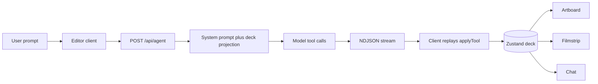
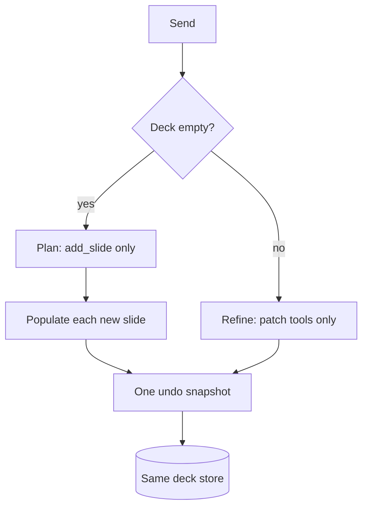
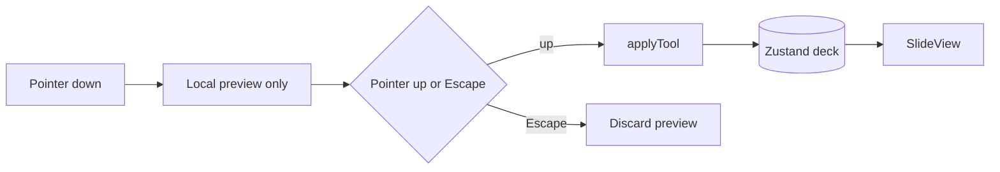

# Presentation Builder

Design decisions and the tradeoffs that came with them. Screen layout lives in `docs/design.md`.

## Decisions

- One deck in a Zustand store. Chat, artboard, filmstrip, undo, and print all read it.
- Every write goes through the same reducers (`applyTool`). A drag and a model `move_element` are the same operation.
- Slides are elements with frames in a 1920×1080 space. Array order is z-order. Charts, tables, images, text, and shapes are the same kind of object.
- The artboard is DOM, not a `<canvas>`. Each element is an absolutely positioned div. One CSS scale maps logical units to the screen.
- Hit targets, selection, handles, guides, and the text caret sit in an overlay in that same coordinate space. Content components do not own the drag.
- `SlideView` is the only renderer. The artboard, filmstrip thumbnails, and the print page all use it.
- The model edits by tool calls (add/update/delete/move/resize, plus chart tools). There is no "return the whole deck" tool.
- An empty deck is plan, then fill: `add_slide` only, then one populate request per new slide. A deck that already has slides takes the refine phase and patches.
- The server holds no deck. Each request gets the current deck, runs tools on a copy, and streams the calls. The client replays them with the same reducer and a shared id seed.
- Manual edits wait while a model turn is streaming. The turn commits as one undo step.
- Undo is full deck snapshots in memory, cap 50, cleared on refresh. The deck and the transcript persist in IndexedDB.
- Export is the browser print dialog (Save as PDF). Charts and positions are the same DOM as the editor.
- Themes restyle elements that have no explicit color. Frames and text stay put.

## Tradeoffs

- DOM over a bitmap canvas. Text carets, table cells, Recharts, and print stay real. The cost is that every thumbnail mounts a full slide, and charts lay out at logical size before CSS shrinks them.
- Shared reducers over separate UI and AI code paths. One source of truth. The model and the toolbar cannot invent different documents.
- Client mirror over shipping the deck back. The model can chain tool results inside one request. The client must apply the same args in the same order. A repair that happens only on the server can desync the two copies.
- Writes locked during a turn. A mid-turn drag cannot land on a snapshot the server already took. The user cannot edit until the turn commits or stops.
- Plan, then one populate call per slide. A patch cannot wipe the deck, and one completion stays inside the output cap (4096). A 7-slide generate is 8 round-trips, and each populate prompt resends the whole deck, so context grows with the square of the slide count.
- Full-deck projection. The model always sees current ids, frames, and content, including after a drag. Long decks pay for slides the user did not mention. The next step is ids and titles for every slide, and full elements only for the slides in the request.
- Snapshot undo. Simple, and structural sharing keeps it cheap. A 50-step history is not a patch log. It is not saved across refresh.
- One renderer for editor, thumbnails, and print. Positions cannot drift between surfaces. Thumbnails pay editor cost on every pointer move.
- Print to PDF over PPTX. Charts, tables, images, and frames survive. There is no PowerPoint file.
- Image upload is schema-only (`asset` source). The Replace button is disabled. AI images are URLs or placeholders.
- Alignment guides over a forced grid. Edges and centers snap within a few screen pixels. Elements can still overlap. Omitted `y` on an AI insert stacks under the lowest element.
- Slide cap of 12, enforced in the reducer. A runaway plan cannot buy a populate call per extra slide. Larger decks are out of scope until the projection is windowed.
- `types.ts` and the Zod schema are maintained side by side. The app and the wire can drift.

## Flow

Generate, or refine a deck that already has slides:

Phase sequence on the client:

A hand edit:

